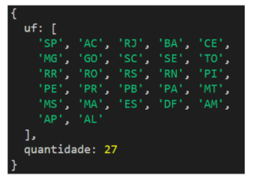
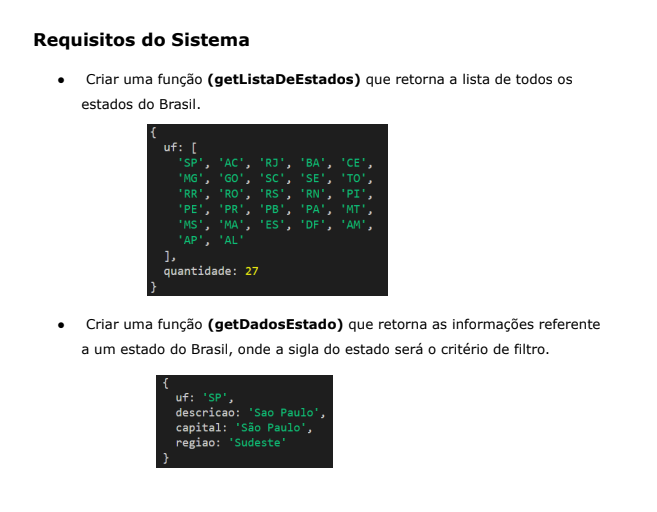
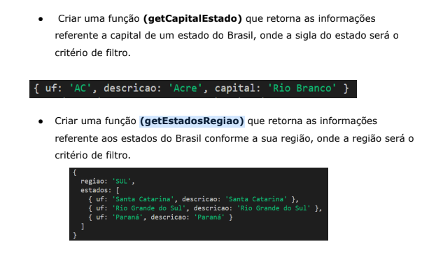
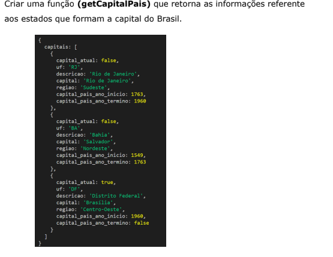
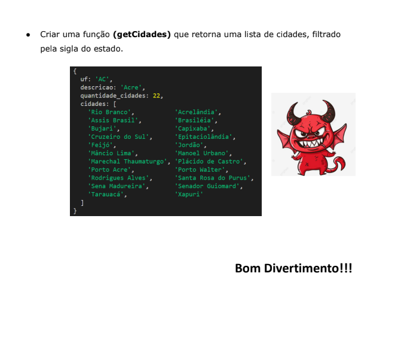

##### como fazer a atividade
###### a estrutura será assim
* Projeto
* app.js - deve tá vazio
* na pasta modulo
** arquivo.js - que o professor irá disponibilizar este arquivo, não pode muda NADA 
** funções.js - que poderemos usar
*** tera uma função de lista de estados que deve return exatamente o que esta na foto:

*** tem que usar o mesmo nome que está na atividade
** sempre olhar as fotos para entender o que foi pedido

## Obrigatorio:
## Minhas funções de filtro tem que retornar um false, não deve HIPOTESE ALGUMA SE USAR IRA MORRER VENDO CÓDIGO!! não deve usar redline!!!!!